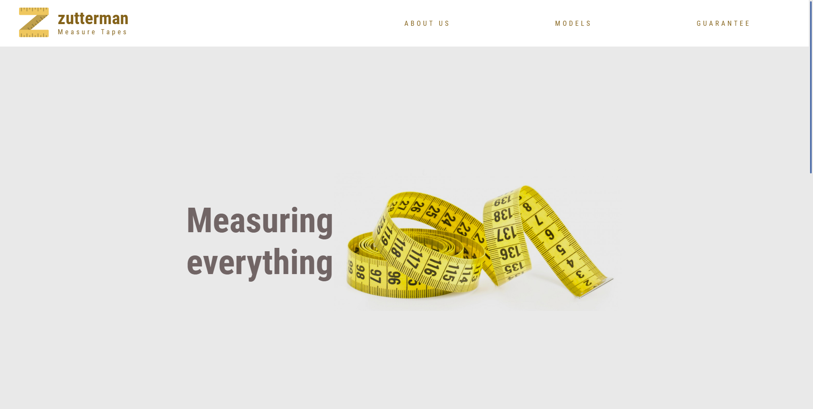

# Calindra: Desafio Front End 2 👨🏻‍💻

  <a href="#sobre">Sobre</a>&nbsp;&nbsp;
  <a href="#andamento">Andamento</a>&nbsp;&nbsp;
  <a href="#linguagens">Softwares & Ferramentas utilizadas</a>&nbsp;&nbsp;
  <a href="#habilidades">Habilidades adquiridas</a>&nbsp;&nbsp;
    <a href="#contribuir">Como contribuir</a>&nbsp;&nbsp;
  <a href="#autor">Autor</a> 

<h2 id="sobre">Sobre 🔎</h2>
  
Dado o layout fornecido disponível no link abaixo, desenvolver o layout, observando as práticas de semântica e responsividade, com boas práticas de utilização dos recursos, sejam CSS, JS, etc. Você poderá pedir qualquer tipo de recurso extra para o site (ex. fontes, vetores entre outras coisas que achar necessário).

  
Para visualizar o layout proposto <a href="https://www.figma.com/file/GTEyrXtVtgSDeiocLk7KzCFf/layout-teste-avaliacao?node-id=0%3A1">clique aqui</a> e para visualizar o projeto finalizado, <a href="https://ytallobruno.github.io/CalindraDesafioFrontEnd2/">clique aqui</a>.

 

<h2 id="andamento">Andamento do projeto 📈</h2>

  

<h2 id="linguagens">Softwares & Ferramentas utilizadas nesse projeto 📚</h2>

  - [x] HTML
  - [x] CSS
  - [x] Git

<h2 id="habilidades">Habilidades Adquiridas 📝</h2>

  - Desenvolvimento de páginas a partir de um layout pré-definido (figma)
  - Responsividade (CSS)
  - Propriedades (CSS)
  - Semântica do html
  - Trabalho com prazos

<h2 id="contribuir">Como contribuir 📫</h2>

Para contribuir com meu projeto, siga estas etapas:
  >- Bifurque este repositório.
  >- Crie um branch: `git checkout -b <nome_branch>`.
  >- Faça suas alterações e confirme-as: `git commit -m '<mensagem_commit>'`
  >- Envie para o branch original: `git push origin <nome_do_projeto> / <local>`
  >- Crie a solicitação de pull.
*Consulte a documentação do GitHub em* [como criar uma solicitação pull](https://help.github.com/en/github/collaborating-with-issues-and-pull-requests/creating-a-pull-request).

  
  **Criado e desenvolvido por [Ytallo Bruno](https://www.linkedin.com/in/ytallobruno/).**
  
 
 
  
   &nbsp;&nbsp;&nbsp;&nbsp;&nbsp;
  
   &nbsp;&nbsp;&nbsp;&nbsp;&nbsp;
  
  

 

  &#11165;&nbsp;<a href="#inicio"><strong>Voltar ao topo</strong></a>&nbsp;&#11165;

